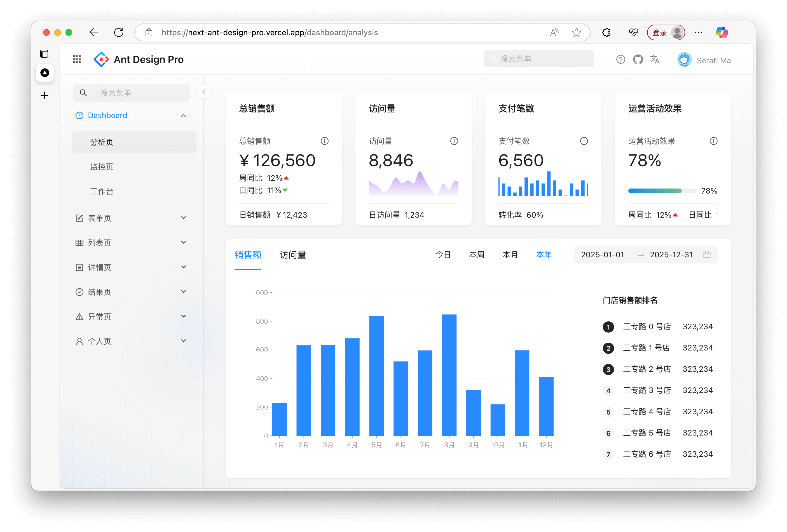

# Ant Deisgn Pro for Next.js

<p align="center">
  <a href="https://next-ant-design-pro.vercel.app" target="_blank">
    
    <br>
    Live Demo
  </a>
</p>

## What's inside?

This Turborepo includes the following packages/apps:

### Apps and Packages

- `web`: a [Next.js](https://nextjs.org/) app
- `api`: a [Express](https://expressjs.com/) app, include mock api
- `@repo/ui`: a stub React component library shared by applications
- `@repo/eslint-config`: `eslint` configurations (includes `eslint-config-next` and `eslint-config-prettier`)
- `@repo/typescript-config`: `tsconfig.json`s used throughout the monorepo
- `@repo/mock`: mock untils for development

Each package/app is 100% [TypeScript](https://www.typescriptlang.org/).

### Utilities

This Turborepo has some additional tools already setup for you:

- [TypeScript](https://www.typescriptlang.org/) for static type checking
- [ESLint](https://eslint.org/) for code linting
- [Prettier](https://prettier.io) for code formatting

### Build

To build all apps and packages, run the following command:

```
cd next-ant-design-pro

# With [global `turbo`](https://turborepo.com/docs/getting-started/installation#global-installation) installed (recommended)
turbo build

# Without [global `turbo`](https://turborepo.com/docs/getting-started/installation#global-installation), use your package manager
npx turbo build
yarn dlx turbo build
pnpm exec turbo build
```

You can build a specific package by using a [filter](https://turborepo.com/docs/crafting-your-repository/running-tasks#using-filters):

```
# With [global `turbo`](https://turborepo.com/docs/getting-started/installation#global-installation) installed (recommended)
turbo build --filter=web

# Without [global `turbo`](https://turborepo.com/docs/getting-started/installation#global-installation), use your package manager
npx turbo build --filter=web
yarn exec turbo build --filter=web
pnpm exec turbo build --filter=web
```

### Develop

To develop all apps and packages, run the following command:

```
cd my-turborepo

# With [global `turbo`](https://turborepo.com/docs/getting-started/installation#global-installation) installed (recommended)
turbo dev

# Without [global `turbo`](https://turborepo.com/docs/getting-started/installation#global-installation), use your package manager
npx turbo dev
yarn exec turbo dev
pnpm exec turbo dev
```

You can develop a specific package by using a [filter](https://turborepo.com/docs/crafting-your-repository/running-tasks#using-filters):

```
# With [global `turbo`](https://turborepo.com/docs/getting-started/installation#global-installation) installed (recommended)
turbo dev --filter=web

# Without [global `turbo`](https://turborepo.com/docs/getting-started/installation#global-installation), use your package manager
npx turbo dev --filter=web
yarn exec turbo dev --filter=web
pnpm exec turbo dev --filter=web
```

## Templates

```
- Dashboard
  - Analytic
  - Monitor
  - Workspace
- Form
  - Basic Form
  - Step Form
  - Advanced From
- List
  - Standard Table
  - Standard List
  - Card List
  - Search List (Project/Applications/Article)
- Profile
  - Simple Profile
  - Advanced Profile
- Account
  - Account Center
  - Account Settings
- Result
  - Success
  - Failed
- Exception
  - 403
  - 404
  - 500
- User
  - Login
  - Register
  - Register Result
```
